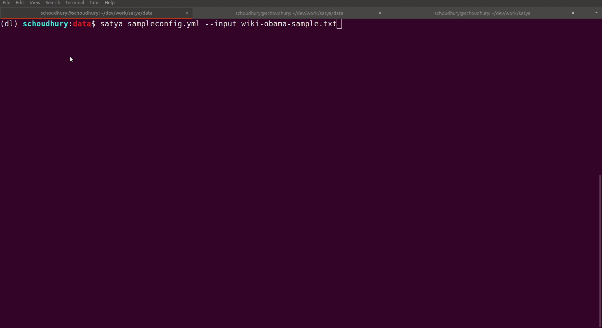
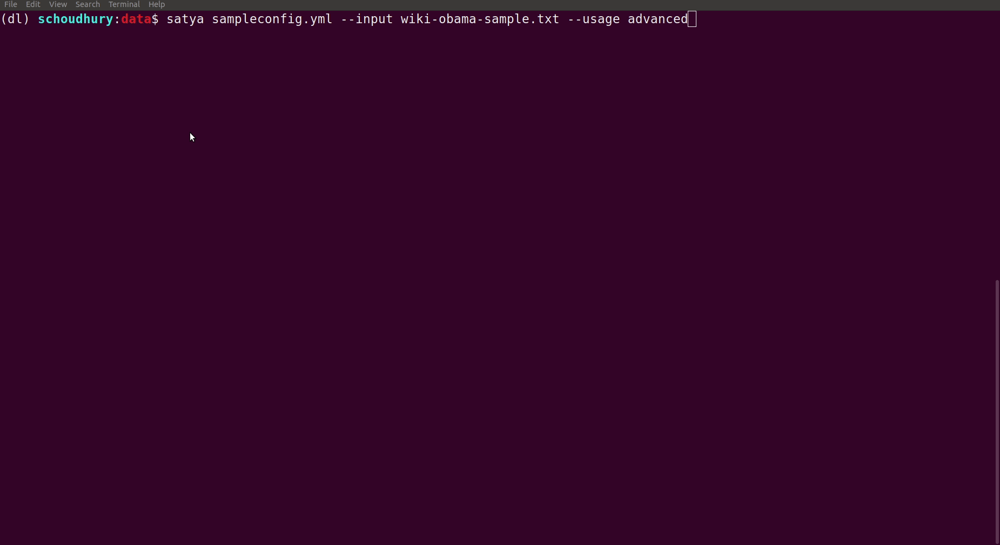

## SATYA: Span Annotation Tool, Yet Another

`SATYA` is a Tkinter based tool for annotating spans and relations in a text document using only keys. It supports keyboard shortcuts and type-ahead functionality.

### Installation

```
pip install -e .
```
You can run the program as a standalone code: you have to add this directory to your `PYTHONPATH`, cd `annotate` and run `python annotator.py config.yml/json`/

### Requirements

-  python 3.x (This is tested on python 3.6). If you want to use `yml` config files, install [PyYAML](https://pypi.org/project/PyYAML/).


### Usage

#### Span Annotation

```
satya <config-file-name.yml/json>
```

 

#### Span-Relation Annotation


```
satya <config-file-name.yml/json> --usage advanced
```

 


```
usage: SATYA: Span Annotator Tool, Yet Another [-h] [--input INPUT]
                                               [--usage {default,advanced}]
                                               config

positional arguments:
  config                config file to run with

optional arguments:
  -h, --help            show this help message and exit
  --input INPUT         input file to load
  --usage {default,advanced}
                        span annotator(default)/ span-relationship
                        annotator(advanced)

```

The sample config file defines the label names and keyboard shortcuts. A sample yml config file looks like:

```
entities:
- name: LOC
  shortcut: l
  color: IndianRed1
  level: 1
- name: ORG
  shortcut: o
  color: NavyBlue
- name: DATE
- name: STATE
  level: 2
relations:
- name: BORN_IN_DATE
  entities:
    - start: PER
      end: DATE
- name: BORN_IN
  entities:
    - start: PER
      end: LOC
    - start: PER
      end: DATE

```

You need to specify entities and relations as dicts and they must have the `name` parameter. The other attrributes for the entities are optional. The `level` param defines a hierarchy for entity names. Eg:  `LOC` has level 1 and `STATE` has level 2. Therefore, in the sentence `Tom lives in Michigan, USA`, you can first label `Michigan, USA` (or `Michigan`)  as `LOC` and then `Michigan` as `STATE` but not in the reverse order. The default label for any entity is 1. The colors, if not provided, are automatically selectedfrom a pallete.

The annotation process starts by opening a `tk` window. By clicking the `open` button you can select a file with tokenized content (see [the caveats section](#caveats)). The content is loaded in the window. You can select a span of the text and label it. The labeling can be done in two ways: if you start typing some label names, a type-ahead/autocomplete window opens up and the entity label can be selected from there. If you have shortcuts defined, you can press `<ctrl>-<shortcut key>` to select the label. The label will be added to the selected content. For more details about annotating entities and relations see the [docs](docs/README.md).

Every change in the text area is saved in a file called `filename.json`. Once you close the annotator window, you can open that file itself in the later annotation sessions. You can click on the `export` button to export the content in the BIO format.

### Motivation

There are multiple span annotation tools available, most notably [brat](https://brat.nlplab.org), [YEDDA](https://github.com/jiesutd/YEDDA) and [SLATE](http://jkk.name/slate/). `brat` is excellent for multi people collaboration but has no keyboard support: every span has to be selected by mouse which reduces the annotation speed. `SLATE` is lightweight, terminal-based and allows key-based span selection. `YEDDA` is a tkinter based GUI system which also allows key-based span selection. Both `YEDDA` and `SLATE` uses character shortcuts for labels, i.e., you select a span and press a character key: a label is assigned to the selected span based on a pre-defined label short cut. However, for larger label spaces both `YEDDA` and `SLATE` are ineffective: a. it is hard to remember the shortcuts and b. if the label space is larger than 26, there are not enough chars to define the shortcuts.

`SATYA` tries to solve this problem by allowing both type-ahead and label shortcuts. While the interface is very similar to `YEDDA`, it is a complete re-implementation (some of the frame UI code is taken from `YEDDA`). It also has some extra features to a. make it easy to add multiple _level_ of labels (imagine labeling for named entity recognition and named entity linking together), and b. alleviate some common errors (can not remove labels from a partially selected span or relabel it).

This tool is primarily intended for NLP practitioners looking for a lightweight, keyboard-based, fast span annotator.

### Caveats

-  The text must be tokenized before you start annotating and the tokens must be joined by a single whitespace.

### Fun fact
It's a [backronym](https://en.wikipedia.org/wiki/Backronym) for a Sanskrit word meaning [truth](https://en.wikipedia.org/wiki/Satya).
