### Usage

#### Starting the program

`satya <config.<yml|json>>`. [A sample config file](../data/sampleconfig.yml) can be found in the [data](../data) directory. It looks like this:

```
label_shortcuts:
  l: LOC
  o: ORG
  p: PER
labels:
- PER
- LOC
- ORG
- DATE
- JOB
```

There are five labels and three shortcuts defined. The label names are what a selected text span will be labeled with. The shortcuts are a mapping between an input key and a label: in other words, if you press `ctrl-l` on a selected text, you will label it as `LOC`. You can use any character key for shortcut except `q`, `z` and `r`.

The command should open the following window:
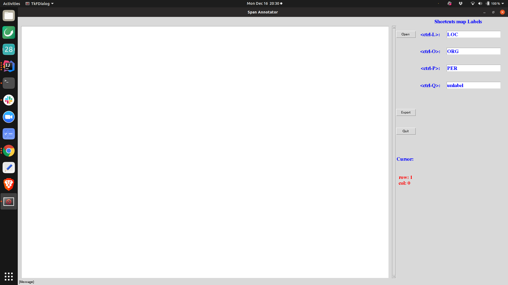

If you click on the `open` button a file open window opens up which allows you to select a file.
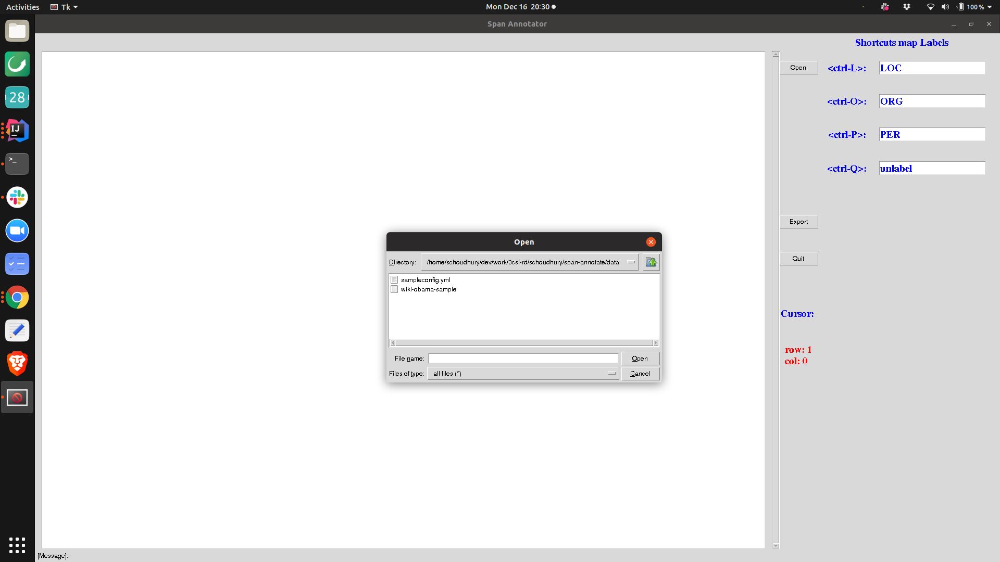

When the file is selected, the content is loaded on the editor window (this window is uneditable).
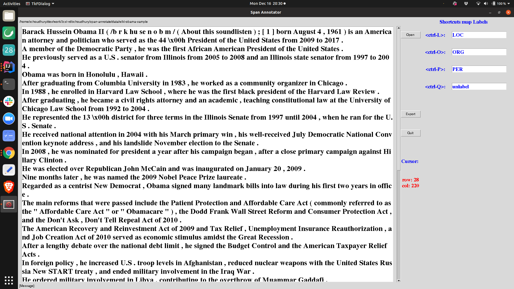.

**Important**: The content must be pre-tokenized and joined on a single white space character.

### Labeling

There are two ways of labeling: type-ahead and shortcut.

After you select a text span, start typing anything and a type-ahead window will pop up:
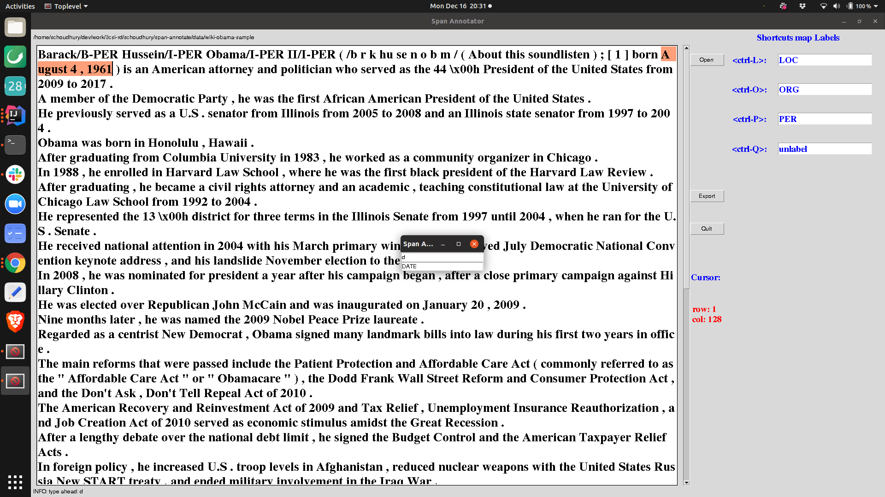. Once you select a label name that label will be applied to the text in `BIO` format and the span will be highlighted as shown below:
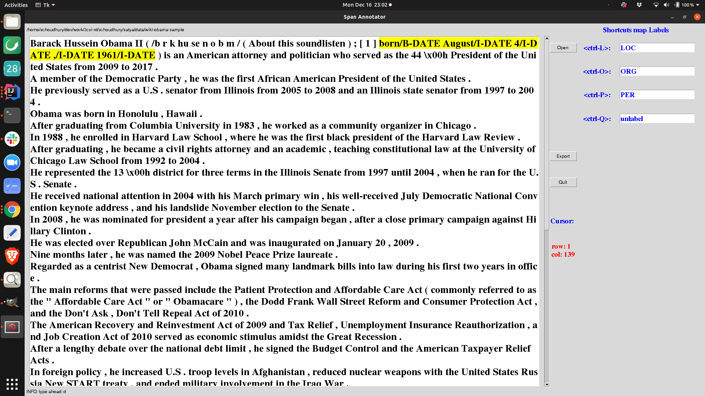.

Another way to label is by using shortcuts. The picture below shows the user has selected a span in the text:.

Pressing `<ctrl-p>` labels that span with label `PER` and the highlight is moved to the last selected span: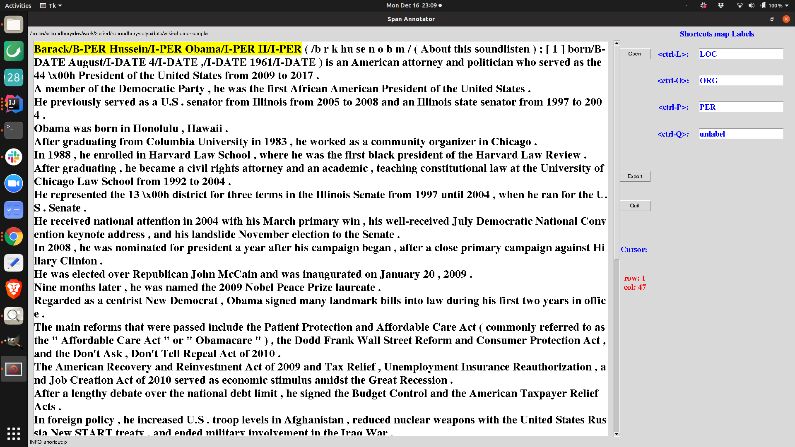

You can add multiple labels to the same span: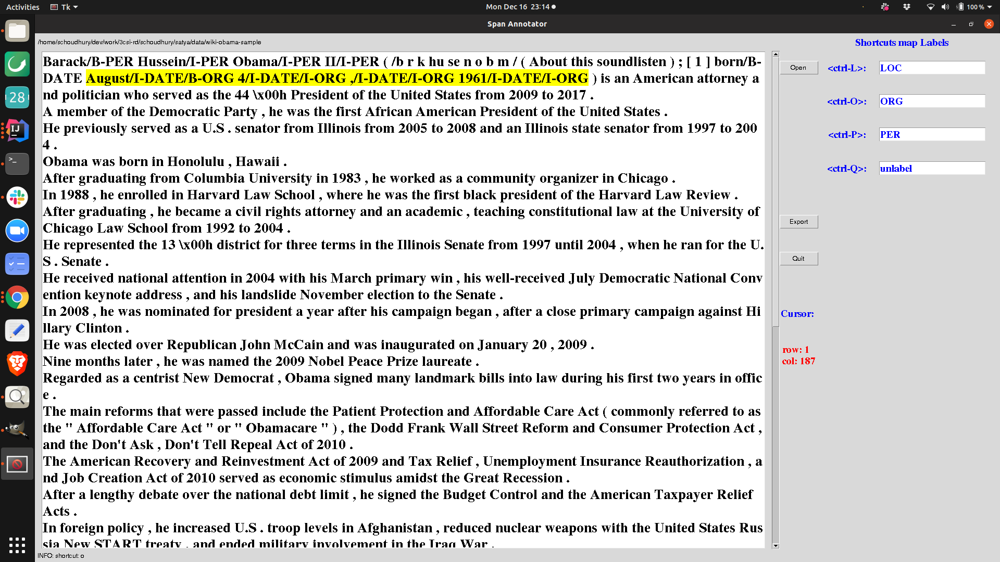.

If you mistakenly select _part_ of a span, as in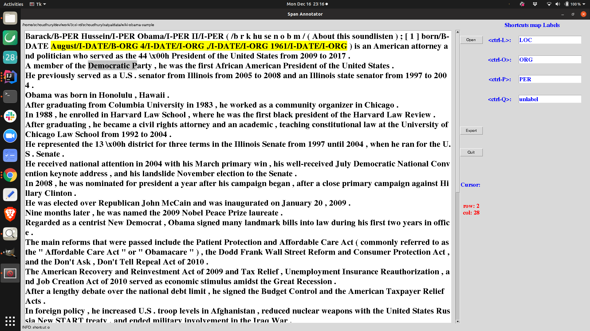, the whole span will be labeled (this is why the content needs to be pre-tokenized and joined on a single white space character) as below: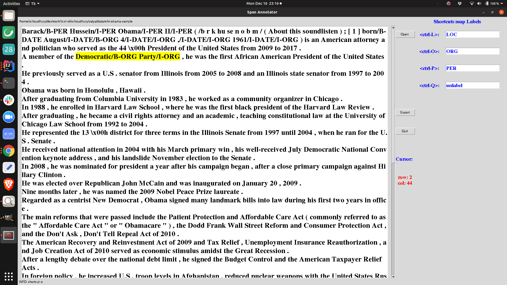


### Un-labeling and Re-labeling

Often one needs to un-label/re-label a span.

`<ctrl-z>` is the command to undo the last change.

`<ctrl-q>` is the command to un-label any span. You need to select the _full span_ as shown below:
. After that pressing `<ctrl-q>` will un-label the span: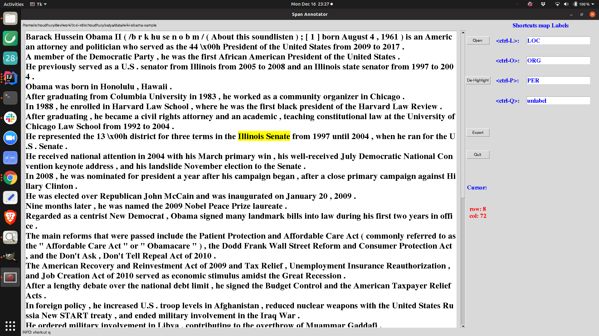. If your span is `x/B-a y/I-a z/I-a` and you just select `x/B-a y/I-a` and press `<ctrl-q>`, un-labeling will not work and you will see an error message in the message bar of the window: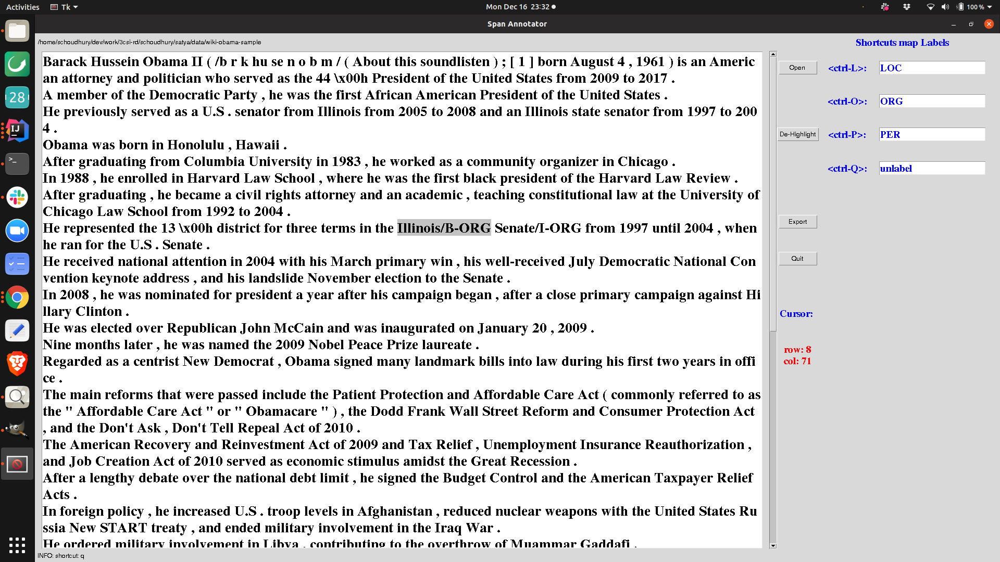.

`<ctrl-r>` is the command to re-label a span. If you press `<ctrl-r>` anywhere in the editor, the closest _labeled_ span enclosing the cursor will be unlabeled and the text will be automatically selected. You can then use the type-ahead or shortcuts to re-label that span. Nothing will happen if such a span does not exist. Compared to `<ctrl-q>`, this saves some time: you do not need to select a span to un-label then relabel it.

It would seem that the `<ctrl-r>` command subsumes `<ctrl-q>`. Under normal circumstances that is true. However, if you have multiple levels of labeling, it is hard to unambiguously determine the smallest enclosing labeled span from a cursor. Suppose your string is `a/B-x b/I-x/B-y c/I-x/I-y/B-z`, and your cursor is on b. Is the correct span `a/B-x b/I-x/B-y` or `b/I-x/B-y c/I-x/I-y/B-z`? If you have such multiple levels of span, you can re-label by `<ctrl-q>` followed by the labeling procedure.

### Exporting the content

If you click on the export button, a BIO format conll file will be created. The software is mostly [WYSIWYG](http://en.wikipedia.org/wiki/WYSIWYG).
